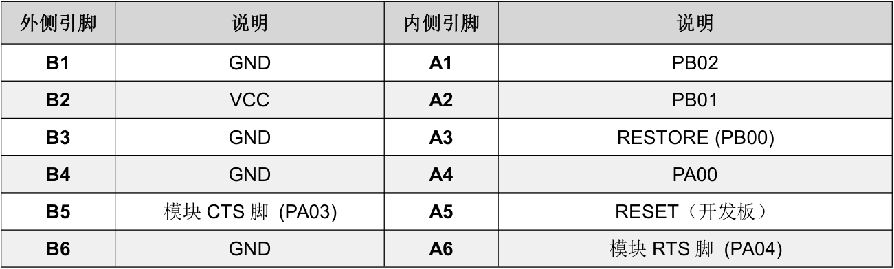
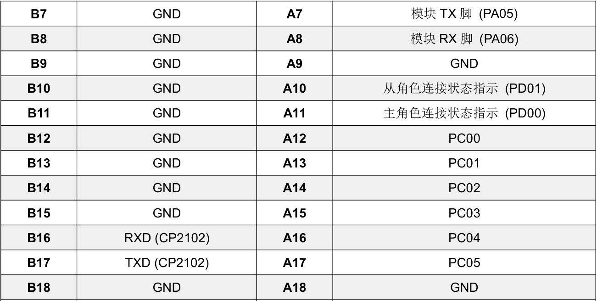
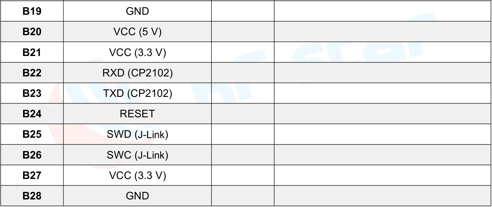
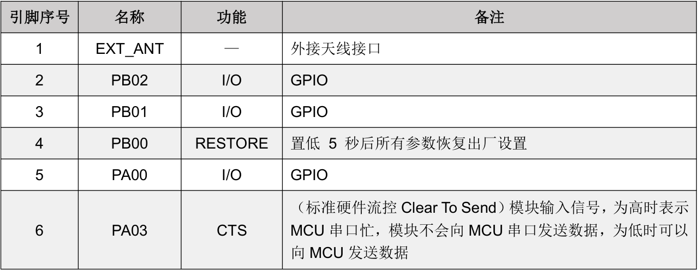
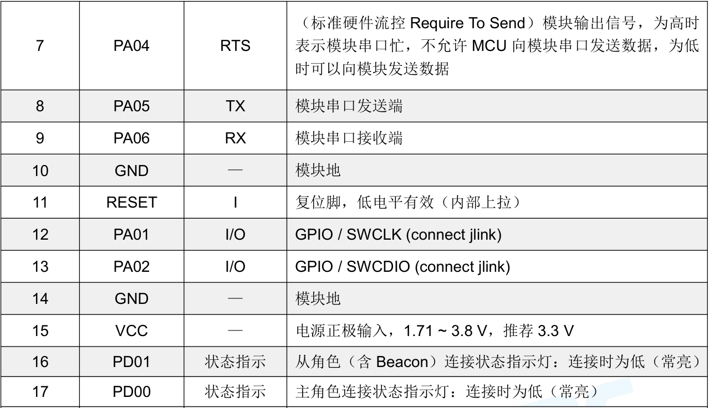
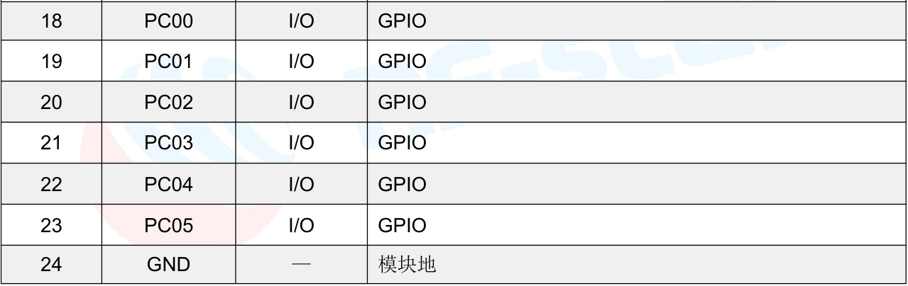

JLink使用说明
===

# 1 JLink模块(SWD接口)

## 1.1 外观

## 1.2 引脚说明(SWD接口)

* 引脚图

 

* 说明

    SWD接口相对于JTAG接口，使用更少的信号。四根信号如下：VCC、GND、SWDIO、SWCLK。
    
    | 编号 | 名称     | 说明                                                         |
    | ---- | -------- | ------------------------------------------------------------ |
    | 1    | TDO      | 可选SWO，串行数据输出引脚。CPU调试接口可通过SWO引脚输出一些调试信息。 |
    | 2    | RST      | 可选RESET，仿真器输出至目标CPU的系统复位信号。               |
    | 3    | TDI      | TX串口发送                                                   |
    | 4    | GND      | 接地                                                         |
    | 5    | RX       | RX串口接收                                                   |
    | 6    | CLK      | SWCLK，串行时钟输入。作为仿真信号的时钟信号线，建议下拉。    |
    | 7    | GND      | 接地                                                         |
    | 8    | DIO      | SWDIO，串行数据输入输出。作为仿真信号的双向数据信号线，建议上拉。 |
    | 9    | 5V       | 对外供电，输出5v                                             |
    | 10   | 3V3/VRef | VRef，目标板参考电压信号，用于检查目标板是否供电，直接与目标板VDD联，并不对外输出电压。 |

## 1.3 使用及注意事项
  * 可以为开发板提供5v或者3.3v电源
  * 可以使用JTAG模式或者SWD模式

# 2 模块连接图

## 2.1 RF-BT02 和 RF-BM-BG22A1/A2/A3 模块引脚图

## 2.2 模块引脚和开发板引脚关系表

**注：B5 为模块的 GPIO PA03，A5 为开发板的 Reset 脚。**

## 2.3 模块 RF-BM-BG22A1/A2/A3 引脚说明

